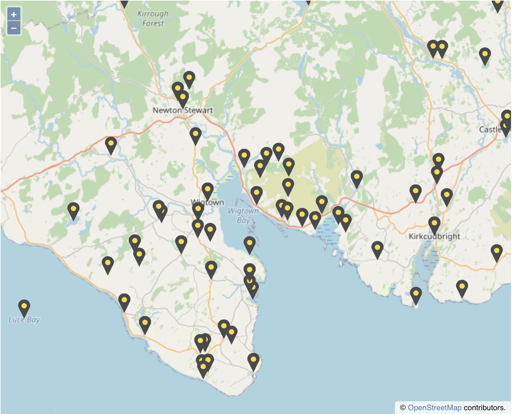

# RESP-work

Test repository for the CRC Regional Ethnology of Scotland Project (RESP) web-mapping internship.

## Contains:

- a png ("Bluemarker.png") used to test different web map designs.
- a Python script ("Geocoding.py") that loops through any list of place names ("lista.csv") and returns a list of geographic coordinates for each place name ("AC_list.csv").

